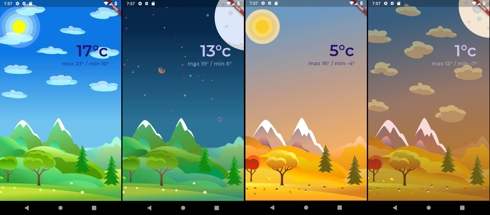
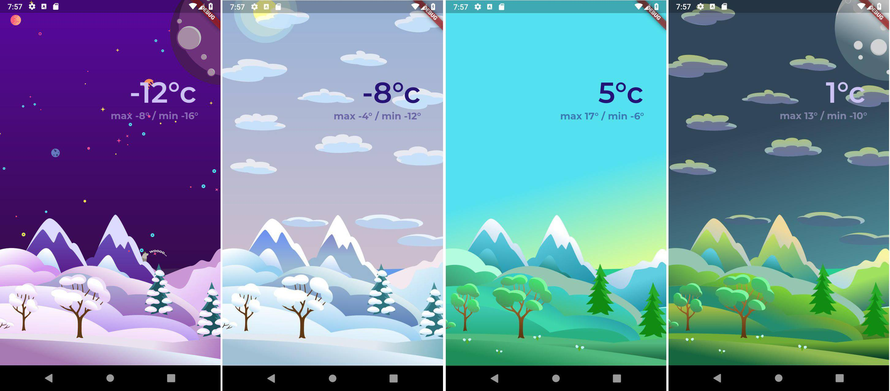

# Seasons

My project for [Flutter Create](https://flutter.dev/create) contest.

The app shows weather statistics in some place. You can see average/min/max temperature for one of four seasons at the
time of a day. For example, what was the average spring temperature measured at 12:00 every day. By swiping left-right
you can choose a season, by swiping up-down - time of a day. You can pause vertical swipe at any point between day and
night, and then see different seasons. The main point of the app is to show interactive animations powered by Flutter.

Flare assets:

  - [autumn.json](https://www.2dimensions.com/a/alyosha.design/files/flare/autumn-day-night/preview)
  - [spring.json](https://www.2dimensions.com/a/alyosha.design/files/flare/spring-day-night/preview)
  - [summer.json](https://www.2dimensions.com/a/alyosha.design/files/flare/summer-day-night/preview)
  - [winter.json](https://www.2dimensions.com/a/alyosha.design/files/flare/winter-day-night/preview)

[Page on Flare](https://www.2dimensions.com/a/alyosha.design/files/recent/all) of the designer, who created these
animations.

# Target Platform

The app must be run on an Android or iOS phone device in portrait orientation.

# Screenshots

